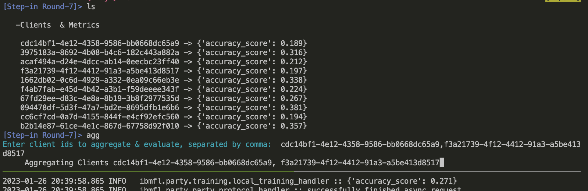

# FedDebug: Systematic Debugging for Federated Learning Applications

*Waris Gill, Ali Anwar, and Muhammad Ali Gulzar. Feddebug: Systematic debugging for federated learning applications. In Proceedings of the 45th International Conference on Software Engineering (ICSE '23). Association for Computing Machinery, New York, NY, USA.*

The ArXiv version of the manuscript is avaibable at : [FedDebug](https://arxiv.org/abs/2301.03553)

For any question regarding FedDebug's artifact should be directed to Waris Gill at [waris@vt.edu ](mailto:waris@vt.edu)

FedDebug enables interactive and automated fault localization in Federation Learning (FL) applications. It adapts conventional debugging practices in FL with its breakpoint and fix & replay featur and it offers a novel differential testing technique to automatically identify the precise faulty clients.FedDebug tool artifact comprises a two-step process
  - Interactive Debugging Constructs integrated with IBMFL framework via **FL simulation in a Docker Image**  
  - Automated Faulty Client Localization  via **Google Colab Notebooks**


# 1. Interactive debugging of FL Applications in IBMFL with FedDebug
FedDebug's interactive debugging module takes inspiration from traditional debuggers, such as gdb, and enables real-time interactive debugging on a simulation of a live FL application. 

Below, we provide step-by-step walkthrough of FedDebug's interactive debugging features in IBMFL. For ease of installation, we offer pre-configured *Docker Image* of FedDebug enabled IBMFL.  

## Step 1.1: Build FedDebug's Docker Image and Initiate
Go to `debugging constructs` directory (`cd debugging-constructs`). Please type `"docker build -t ibmfl ."`.  It will build docker form the `Dockerfile`. To run and interact with `ibmfl` docker type the following command `docker run -it ibmfl`. It will start the docker and now you can interact with it. Type `ls` in the docker shell to display the current directory content to check whether everything is installed correctly.  You can check more about dockers on the following link [Docker Tutorial](https://docs.docker.com/get-started/).

```
cd debugging-constructs
docker build -t ibmfl .
docker run -it ibmfl
ls
```


### Tmux Tutorial
In this tutorial, we will be using Tmux to simulate a distributed FL environment in Docker, representing both FL clients and aggregator. Tmux is a terminal multiplexer that allows you to split your terminal screen horizontally. Tmux allows us to interact with the client and aggregator side of IBMFL and seemlesly move between those two interfaces. To start tmux, simply type '`tmux`' in the terminal. You can check more about `tmux` on this link [Tmux Quick Tutorial](https://www.hamvocke.com/blog/a-quick-and-easy-guide-to-tmux/).
  
### Splitting Screen in Tmux
To split the screen horizontally, type in a tmux session ` Ctrl + b` followed by `shift + " `. It will split the screen into two terminals. 
<!-- To split the screen horizontally, type in a tmux session ` Ctrl + b + " `. It will split the screen into two terminals.  -->


 
You can move between terminals (panes) by pressing `Ctrl + b` followed by the `up` and `down` arrows keys. 

  
## Step 1.2: Running the Aggregator in FedDebug enabled IBMFL
In one of the tmux terminals, type `python sim_agg.py` to run the aggregator.


After running this command, you will see the following output: "Press key to continue." Right now, ***do not press any key*** and move to another tmux terminal.


  
## Step 1.3: Running the Parties/Clients in FedDebug enabled IBMFL
In the second terminal, type `python sim_party.py`. This will start the ten parties and connect them to the second aggregator.

After running this command, you will see the following output:


## Step 1.4: Starting the Training
Move back to the aggregator terminal and press `enter key`. This will start the training from the aggregator for `10 rounds with 10 clients`.  Currently, breakpoint is set at round 5, so the terminal will stop displaying logs after `round 5` and you will see the following output:

. 

***Note: you can change the `breakpoint` round id in `sim_agg.py`*** 

## Step 1.5: FedDebug Interactive Debugging Constructs 

**`help:`** You can type `help` to see all the commands available at the round level in the debugger.


  
**`ls:`** The `ls` command at the round level will display generic information about the round.


**`step next, step back, and step in:`** You can also use the `step next`, `step back`, and  `step in` commands to navigate through the rounds.


## Step 1.6: Navigating inside a Round with FedDebug

After `step in` you can also type `help` to see the commands available inside a round.


 
**`ls:`** You can use the `ls`  command inside a round to display all the clients in the round with their accuracies. 

**`agg:`** Similarly can also use the `agg` to partially aggregate the models from a subset of clients for the partial evaluation to inspect their performance. 

**Note: We have replace `step in` command inside the round with `agg` to avoid any confusion with  `step in` command of  rounds.** 

  



 
**`step out:`** To leave a round, you can also use the `step out` command to step out of a round.


 
## Step 1.7: Removing a Client with FedDebug

**`remove client <client id>:`** Suppose that you identify a faulty client in `round 8`, you can remove its contribution from the round using the `remove client <client id>` command. 


This will resume the training from `round 9` instead of `round 5`, and the faulty client will not be included from `round 8`.


**Note: After removing the client, the training is complete. **
 
## Step 1.8: Resume after a debugging session 

To check the functionality of  `resume` command, restart the aggregator (`python sim_agg.py`) and clients ((`python sim_party.py`))  as explained above. Perform some actions (e.g., `step in, step out, ls` etc ), except  `remove client`. Suppose that there is no faulty client and you want resume the training without any further debugging. You can type `resume` to resume training and you will see that the aggregator immediately displays the the output of all the rounds without any retraining.  

.


# 2. FedDebug: Faulty Client Localization
  
At a given faulty round in an FL campaign, `FedDebug` can automatically identify faulty clients without needing test data or labels. The following steps provide a walk-through of this feature using both reconfigurable computational notebooks as well as local python setup. 

## 2.1 Installation

### Google Colab Setup

> ***Make sure you configure the notebook with GPU: Click Edit->notebook settings->hardware accelerator->GPU***


Copy & paste the following commands in the ***first cell*** of notebook (e.g., `artifact.ipynb`) on `Google Colab`.

```
!pip install pytorch-lightning
!pip install matplotlib
!pip install diskcache
!pip install dotmap
!pip install torch torchvision torchaudio
!git clone https://github.com/SEED-VT/FedDebug.git
# appending the path
import sys
sys.path.append("FedDebug/fault-localization/")
```

Now you can run the `artifact.ipynb` (<a  target="_blank"  href="https://colab.research.google.com/github/SEED-VT/FedDebug/blob/main/fault-localization/artifact.ipynb"></a>). You can run notebooks containing `FedDebug` code with the above instructions. **Note:**  *You can uncomment the commands instead of copy & pasting if above commands are already in the given notebook.*

The notebook is configured to use the following default settings, where the first client (client id 0) is faulty (with noisy labels that distort the global FL model).  

```
args.model = "resnet50" # [resnet18, resnet34, resnet50, densenet121, vgg16]
args.epochs = 2  # range 10-25
args.dataset = "cifar10" # ['cifar10', 'femnist']
args.clients = 5 # keep under 30 clients and use Resnet18, Resnet34, or Densenet to evaluate on Colab 
args.faulty_clients_ids = "0" # can be multiple clients separated by comma e.g. "0,1,2"  but keep under args.clients clients and at max less than 7 
args.noise_rate = 1  # noise rate 0 to 1 
args.sampling = "iid" # [iid, "niid"] 
```

Once the entire notebook is exectued, the logs report the progress and eventually print the id of the client that is faulty. This is printed in the form `+++ Faulty Clients {0}` where 0 is the client id, for each auto generated input (defautl is 10).  It also reports the final localization accuracy. 

  

### Local Setup

  

  

1. Create a conda environment for example: `conda create --name feddebug`

2. Activate environment: `conda activate feddebug`

3. Install necessary packages:
```
pip install pytorch-lightning
pip install matplotlib
pip install diskcache
pip install dotmap
pip install jupyterlab
pip install torch torchvision torchaudio
pip install jupyterlab
```

  

4. Clone `FedDebug` repository and switch to it.

```
git clone https://github.com/SEED-VT/FedDebug.git
cd FedDebug/fault-localization
```

>Note: Make sure you are in project directory `~/FedDebug/fault-localization`.

5. Run `jupyter-lab` command in `fault-localization` directory. It will open the jupyter-notebook in the project directory. Open and run `artifact.ipynb`. This should work without any errors.


See `INSTALL.md` for further instructions on how to setup your environment for fault localization.

***Note: To run locally, make sure you have an NVIDIA GPU in your machine.***

  
## 2.2 Evaluations

### Datasets
`cifar10` and `feminist` data are downloaded automatically when running an evaluation script.

### Models
`resnet18, resnet34, resnet50, vgg16, and Densenet121` are CNN model architectures used in evaluation.

### To Evaluate Any Experimental Setting.
We provide a single notebook `artifact.ipynb` (<a  target="_blank"  href="https://colab.research.google.com/github/SEED-VT/FedDebug/blob/main/fault-localization/artifact.ipynb"></a>) with all controlling arguments to evaluate any experimental settings. It can be executed on `Google Colab` but keep clients under 30. Colab has limited computation power and RAM.

```
args.model = "resnet50" # [resnet18, resnet34, resnet50, densenet121, vgg16]
args.epochs = 2 # range 10-25
args.dataset = "cifar10" # ['cifar10', 'femnist']
args.clients = 5 # keep under 30 clients and use Resnet18, Resnet34, or Densenet to evaluate on Colab
args.faulty_clients_ids = "0" # can be multiple clients separated by comma e.g. "0,1,2" but keep under args.clients clients and at max less than 7
args.noise_rate = 1 # noise rate 0.1 to 1
args.sampling = "iid" # [iid, "niid"]

```

  

  

## 2.3 Results:

Although `artifact.ipynb` is sufficient to evaluate any configuration of `FedDebug`, we further extended it to reproduce the major results with just a single click on `Google Colab` except the scalability result `Reproduce_Figure9.ipynb`. You can reproduce the scalability result on a local machine which has enough resources to train 400 models.

  

>***Note: We have scaled down the the experiments (e.g., reduce the number of epochs, small number of clients, etc) to assist reviewers to quickly validate the fundamentals of `FedDebug` and fit with `Google Colab` resources. However, you are welcome to test it with any configuration mentioned in `FedDebug` evolutions. Furthermore, if you see an unexpected result, please increase the number of `epochs` to the value mention in `Section V: Evaluations` and read `Section V.D Threat To Validity section`.***

  

-  **`Reproduce_Figure4-Figure7.ipynb` <a  target="_blank"  href="https://colab.research.google.com/github/SEED-VT/FedDebug/blob/main/fault-localization/Reproduce_Figure4-Figure7.ipynb"></a>:** Figure 4 shows that lower `noise rate` does not impact the performance of the global model and only high `noise rate` degrade its performance. Although low noise rates do not deteriorate global model significantly, `Figure 7` shows that `FedDebug` has the capability to localize the `faulty clients` with low noise rate.

  

-  **`Reproduce_Figure9.ipynb`:** In several prior work simulations, researchers have use a very few clients to participate in a round (usually 10~clients). We challenged our approach to consider hundreds of clients to participate in a round and this notebook shows the result of this evaluation. This notebook cannot run on free available resources of the `Google Colab`. We conducted this experiment on an AMD 16-core processor, with 128 GB RAM and an NVIDIA Tesla T4 GPU.

  

-  **`Reproduce_Figure10.ipynb` <a  target="_blank"  href="https://colab.research.google.com/github/SEED-VT/FedDebug/blob/main/fault-localization/Reproduce_Figure10.ipynb">  </a>:** This notebook reproduces the results of `Figure 10` which shows the `FedDebug` performance on different neuron activation thresholds. We found activation threshold less than 0.01 to perform well across all the experiments. By default, `FedDebug` uses neuron activation threshold of `0.003`.

  

-  **`Reproduce_Table1-Table2.ipynb` <a  target="_blank"  href="https://colab.research.google.com/github/SEED-VT/FedDebug/blob/main/fault-localization/Reproduce_Table1-Table2.ipynb">  </a>:** Table 1 and Table 2 show the performance of `FedDebug` in IID and Non-IID data distribution settings. This notebook contains the representative settings of these two tables. Feel free to test other configurations as well.
